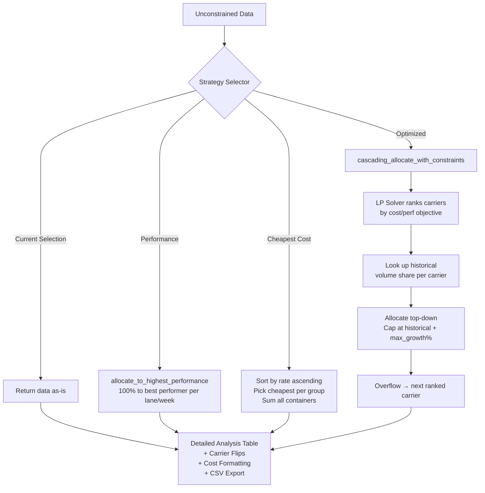
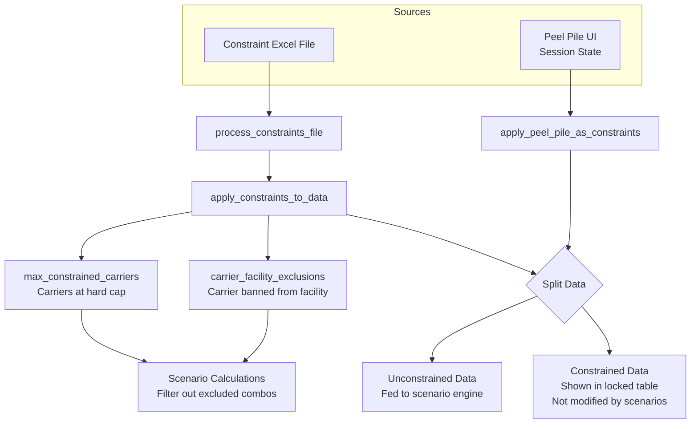
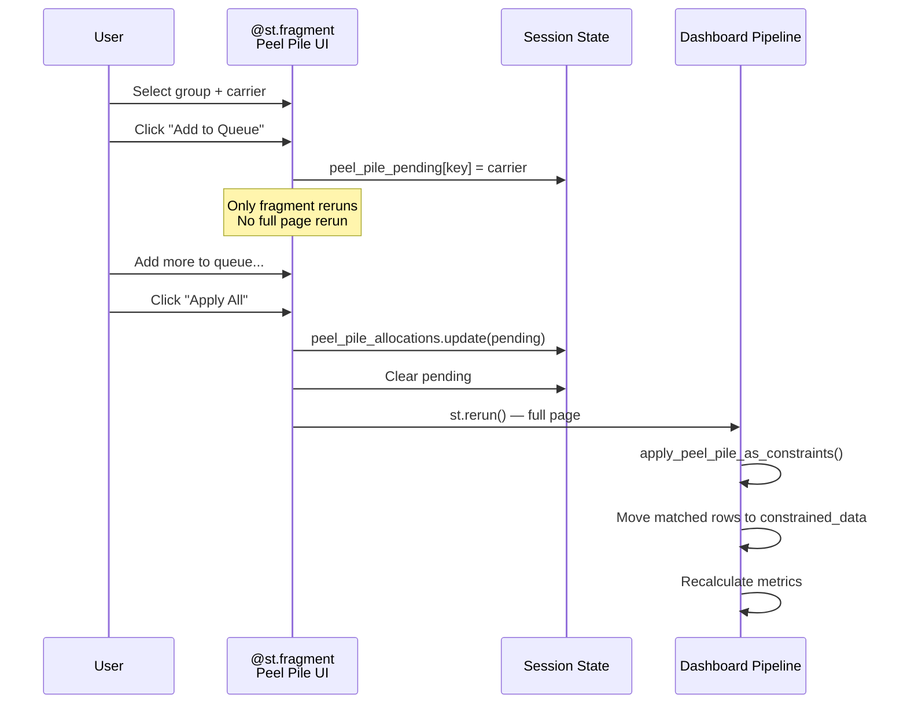
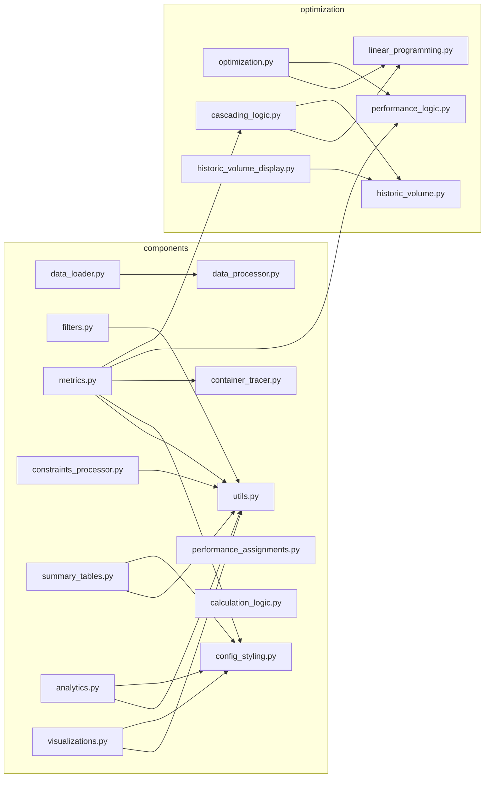

# Architecture Overview

## System Summary

The Carrier Tender Optimization Dashboard is a Streamlit application that helps logistics teams optimize drayage carrier allocations. It ingests container movement data (GVT), carrier rate sheets, and performance scores, then provides 4 allocation scenarios: Current Selection, Highest Performance, Cheapest Cost, and LP-Optimized with historical constraints.

## High-Level Architecture

```mermaid
graph TB
    subgraph Entry Points
        A[dashboard.py<br/>Main Streamlit App]
        B[streamlit_app.py<br/>Cloud Entry]
        C[app.py<br/>Desktop Launcher]
    end

    B --> A
    C -->|subprocess| A

    subgraph Data Ingestion
        D[data_loader.py<br/>File Upload + Excel Reading]
        E[data_processor.py<br/>Validation + Merging]
    end

    subgraph UI Layer
        F[config_styling.py<br/>Page Config + CSS]
        G[filters.py<br/>Filter UI + Rate Selector]
        H[metrics.py<br/>Cost Cards + Analysis Table<br/>+ Peel Pile UI]
        I[summary_tables.py<br/>Aggregation Tables]
        J[analytics.py<br/>Predictive + Anomaly]
        K[visualizations.py<br/>Plotly Charts]
    end

    subgraph Constraint Engine
        L[constraints_processor.py<br/>File-Based Constraints]
        M[constraints_advanced.py<br/>Interactive Constraints]
        N[metrics.py<br/>Peel Pile Constraints]
    end

    subgraph Optimization Engine
        O[optimization.py<br/>Strategy Router]
        P[linear_programming.py<br/>PuLP LP Solver]
        Q[performance_logic.py<br/>Best Performer]
        R[cascading_logic.py<br/>LP + Historical Caps]
        S[historic_volume.py<br/>Market Share Calc]
        T[historic_volume_display.py<br/>Volume Charts]
    end

    subgraph Shared
        U[utils.py<br/>Formatting + Helpers]
        V[container_tracer.py<br/>Movement Tracking]
        W[performance_assignments.py<br/>Score Tracking]
    end

    A --> D --> E
    A --> F
    A --> G
    A --> L
    A --> H
    A --> I
    A --> J
    A --> K
    A --> T

    H --> O
    H --> Q
    H --> R
    O --> P
    O --> Q
    R --> P
    R --> S

    H --> V
    L --> N

## Data Pipeline

```mermaid
flowchart LR
    subgraph Input Files
        GVT[GVT Excel<br/>Container Data]
        RATE[Rate Excel<br/>Carrier Pricing]
        PERF[Performance Excel<br/>Carrier Scores]
        CONS[Constraints Excel<br/>Allocation Rules]
    end

    subgraph Processing
        LOAD[load_data_files]
        VAL_G[validate_gvt_data<br/>Exclude Canada<br/>Parse Ocean ETA<br/>Calculate Week Number<br/>Create Lane/Lookup]
        VAL_R[validate_rate_data<br/>Clean Rates]
        PROC_P[process_performance<br/>Melt Wide → Long]
        MERGE[merge_all_data<br/>GroupBy + Aggregate<br/>Join Rate + Perf<br/>Calculate Totals]
    end

    subgraph Filtering
        COMP[create_comprehensive_data]
        FILT[apply_filters_to_data<br/>Port/Facility/Week/SCAC]
    end

    subgraph Constraints
        PROC_C[process_constraints_file]
        APPLY_C[apply_constraints_to_data]
        PEEL[apply_peel_pile_as_constraints]
    end

    subgraph Deduplication
        DEDUP[deduplicate_containers_per_lane_week<br/>Zero-sum: 1 container = 1 carrier per lane/week]
    end

    subgraph Output
        CONST_D[Constrained Data<br/>Locked Allocations]
        UNCONST_D[Unconstrained Data<br/>Available for Optimization]
    end

    GVT --> LOAD --> VAL_G --> MERGE
    RATE --> LOAD --> VAL_R --> MERGE
    PERF --> LOAD --> PROC_P --> MERGE
    MERGE --> COMP --> FILT
    CONS --> PROC_C --> APPLY_C
    FILT --> APPLY_C
    APPLY_C --> PEEL
    PEEL --> DEDUP
    DEDUP --> CONST_D
    DEDUP --> UNCONST_D
```

## Scenario Calculation Flow



## Constraint System



## Peel Pile Allocation Flow



## Module Dependency Map



## Key Data Columns

| Column | Source | Description |
|--------|--------|-------------|
| `Dray SCAC(FL)` | GVT | Carrier SCAC code |
| `Lane` | Derived | `Discharged Port + Facility` (e.g., `USBALHGR6`) |
| `Discharged Port` | Derived | First segment of Lane |
| `Facility` | GVT | Destination facility code |
| `Week Number` | GVT/Derived | From `Ocean ETA` or `WK num` column |
| `Ocean ETA` | GVT | Vessel arrival date |
| `Container Numbers` | GVT | Comma-separated container IDs |
| `Container Count` | Derived | Count of IDs in `Container Numbers` |
| `Base Rate` | Rate file | Per-container rate |
| `Total Rate` | Derived | `Base Rate × Container Count` |
| `CPC` | Rate file | Cost per container (alternative rate) |
| `Total CPC` | Derived | `CPC × Container Count` |
| `Performance_Score` | Performance file | 0-1 carrier performance score |
| `Category` | GVT (optional) | Business category (FBA FCL, Retail CD, etc.) |
| `SSL` | GVT (optional) | Steamship line |
| `Vessel` | GVT (optional) | Vessel name |
| `Terminal` | GVT (optional) | Port terminal |
| `Lookup` | Derived | `SCAC + Port + Facility` — join key for rates |
| `Missing_Rate` | Derived | Boolean flag for rows with no rate data |

## Session State Reference

| Key | Type | Used By | Description |
|-----|------|---------|-------------|
| `rate_type` | str | filters, metrics, utils | `'Base Rate'` or `'CPC'` |
| `selected_ports` | list | filters | Active port filter |
| `selected_facilities` | list | filters | Active facility filter |
| `selected_weeks` | list | filters | Active week filter |
| `selected_scacs` | list | filters | Active carrier filter |
| `opt_cost_weight` | int | filters, metrics | LP cost weight (0-100) |
| `opt_performance_weight` | int | filters, metrics | LP performance weight (0-100) |
| `opt_max_growth_pct` | int | filters, metrics | Max carrier growth % |
| `peel_pile_allocations` | dict | metrics | Applied peel pile assignments |
| `peel_pile_pending` | dict | metrics | Queued (not yet applied) peel pile assignments |

## Dev Docs Index

Detailed per-module documentation is in `docs/dev/`:

- [Entry Points](dev/entry-points.md) — dashboard.py, streamlit_app.py, app.py
- [Data Loader](dev/components-data-loader.md) — File upload and Excel reading
- [Data Processor](dev/components-data-processor.md) — Validation, merging, the core pipeline
- [Filters](dev/components-filters.md) — Filter UI and application
- [Metrics](dev/components-metrics.md) — Cost calculations, analysis table, peel pile
- [Constraints Processor](dev/components-constraints-processor.md) — File-based constraint engine
- [Container Tracer](dev/components-container-tracer.md) — Carrier flip tracking
- [Utils](dev/components-utils.md) — Shared helpers
- [Other Components](dev/components-other.md) — Styling, summaries, analytics, visualizations
- [Optimization Module](dev/optimization-module.md) — LP, performance, cascading, historic volume
